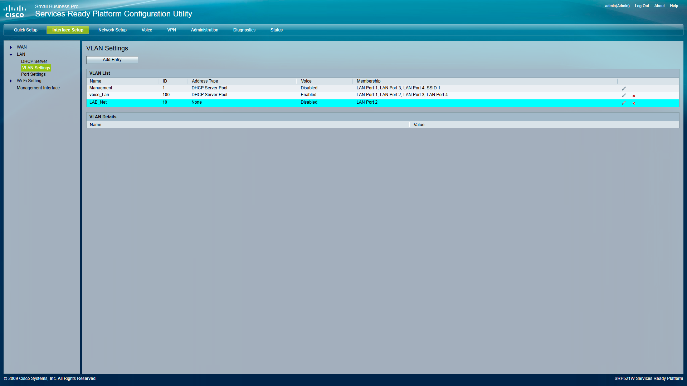
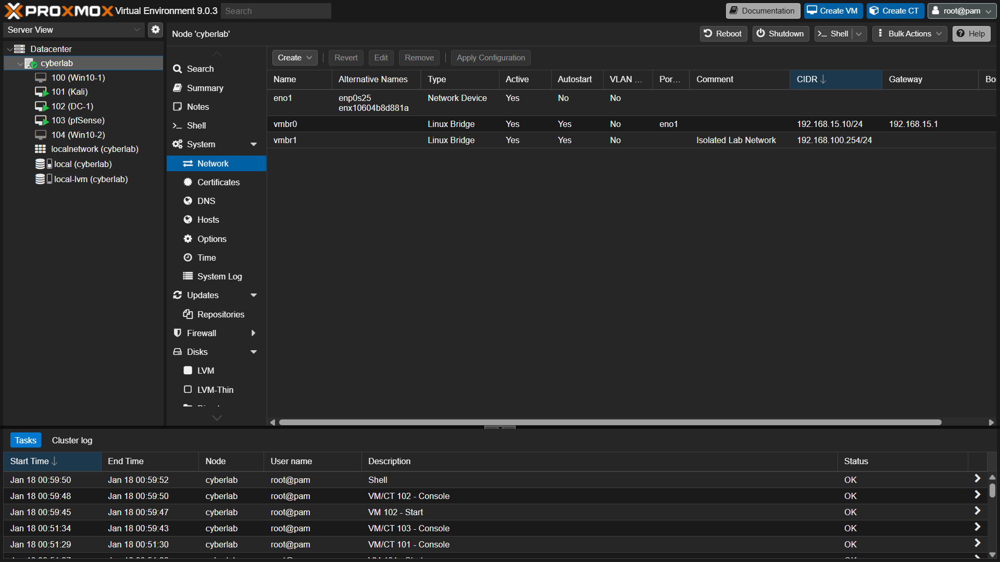
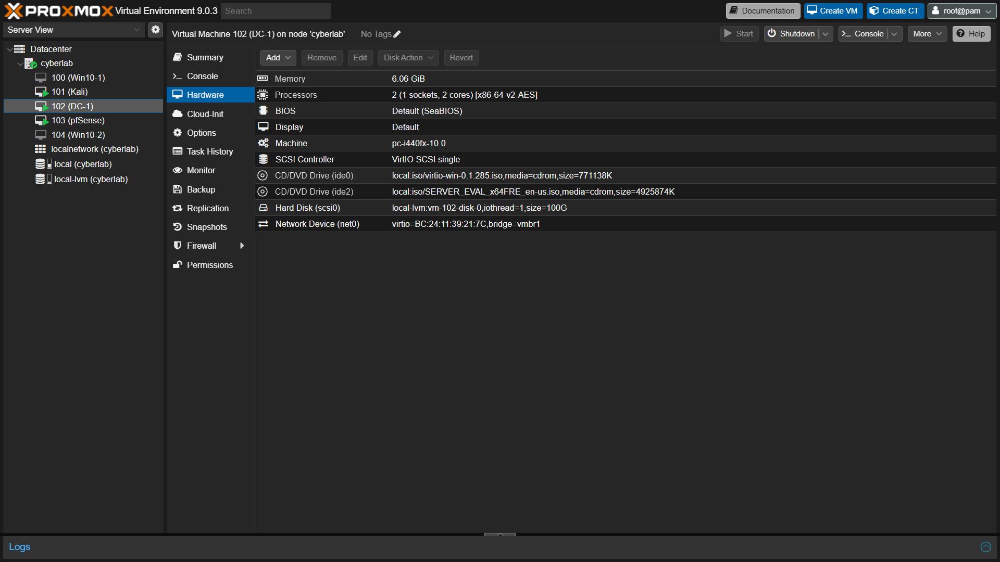

# Hybrid Cyber Defense Infrastructure

## 1. Project Overview
As a System & Network Technician and Cyber Defense Trainee, I engineered a **hybrid segmented network** to simulate a secure enterprise environment. The goal was to integrate physical Cisco hardware with virtualized infrastructure while strictly isolating "Red Team" traffic from the physical LAN.

**Tech Stack:**
* **Physical Networking:** Cisco Small Business Pro SRP500 (VLANs & Routing)
* **Virtualization:** Proxmox VE 8.x (Bridge Isolation)
* **Identity:** Windows Server 2019 (Active Directory/DHCP)
* **Security:** pfSense Firewall & Network Segmentation

## 2. Architecture & Challenges
I implemented a "Double-NAT" Zone architecture to solve a critical issue: **Rogue DHCP Leakage**.
* **The Problem:** My initial Windows Server deployment accidentally broadcasted DHCP offers to the physical network, disrupting other devices.
* **The Solution:** I engineered a "Virtual Cage" using a dedicated Linux Bridge (`vmbr1`) in Proxmox that physically air-gaps the lab from the upstream WAN.

## 3. Configuration Evidence

### A. Physical Segmentation (Cisco SRP500)
I configured the physical router to dedicate **Port 2** exclusively to the Lab Network (VLAN 10), removing it from the default Management VLAN (VLAN 1).

### B. The "Virtual Cage" (Proxmox Networking)
I created a custom Linux Bridge (`vmbr1`) with **no physical ports attached**. This forces all traffic to route through my pfSense firewall, ensuring total isolation.

### C. Secure VM Attachment
Here is the Windows Server Domain Controller ("DC-1") physically hard-linked to the isolated bridge (`vmbr1`), preventing any packets from leaking to the family network.

